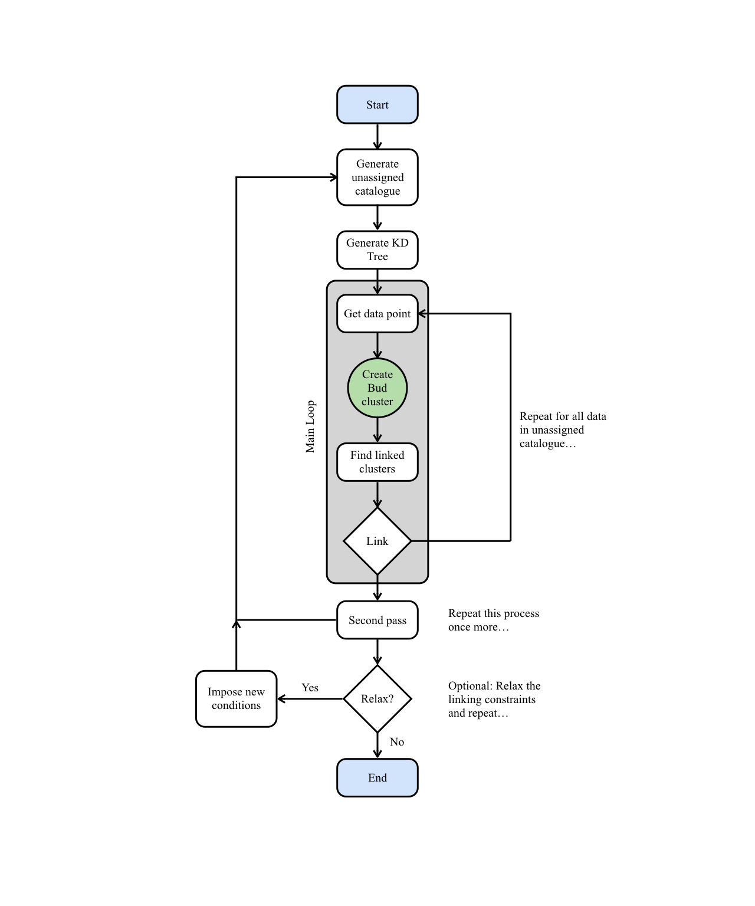
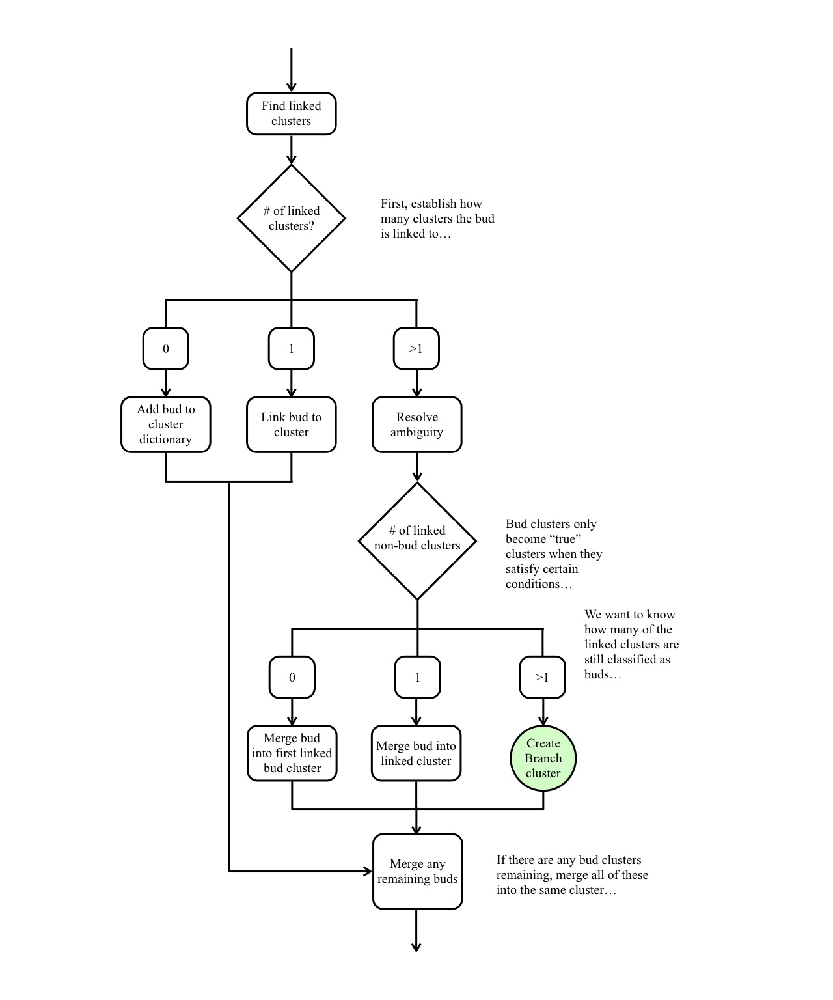

Description of the algorithm
============================

Introduction
------------

``acorns`` follows the philosophy of hierarchical agglomerative clustering (HAC).
HAC methods fall into two main categories: `bottom-up` or `top-down`. ``acorns``
follows the bottom-up approach in that each singleton data point begins its life
as a cluster. Traditionally, clusters then merge until only a single cluster
remains that contains all of the data. The output of this technique is often
visualised graphically as a dendrogram, which have become popular in astronomy
as a convenient way of representing and interpreting the hierarchical nature of
molecular clouds (see e.g. `Rosolowsky et al. 2008 <http://adsabs.harvard.edu/abs/2008ApJ...679.1338R>`_).

Briefly, clustering in ``acorns`` commences with the most significant data
point. In the analysis presented in this work this refers to the data point with
the greatest peak intensity. However, given its applicability of to
different systems, this may instead refer to, for example, a density, column
density, or mass. ``acorns`` attempts to merge this cluster to
already-established clusters in the hierarchy, based on criteria supplied
by the user. It then descends in significance, merging clusters along
the way, until a hierarchy is established.

Input is an array of :math:`n \times m` dimensions, where :math:`n` is a
minimum of 4, but in principle has no upper limit and depends on how many
parameters the user wishes to use during the clustering procedure. As an example,
its simplest form, i.e. clustering in two spatial dimensions, this array should
consist of: x position, y position, intensity (or equivalent), and an
uncertainty on the intensity (or equivalent). If linking in PPV, an additional
column for the velocity is a mandatory requirement.

The linking of clusters is handled via the supply of an array containing :math:`n-3`
elements (or :math:`n-4` if linking in PPP) which describes the clustering criteria
(`cluster_criteria`). Here, the user must supply the maximum spatial
euclidean distance between data points, as well the maximum absolute difference
in any other variable used for linking. If the separation between two data
points satisfy these criteria, the data points are considered to be linked.

In addition the user must supply the following parameters:

* The pixel size in the spatial dimension (`pixel_size`).
* The radius of the smallest structures the user would like ``acorns`` to look for (`min_radius`).
* The minimum height above a merge level for a cluster to be considered as a separate structure (`min_height`).
* The stopping criteria. Given as a multiple of the rms noise level (`stop`).

Main method
-----------

The main steps taken by ``acorns`` in developing the hierarchy are illustrated
in the following flow diagram and in the steps below:

1. ``acorns`` begins by creating a catalogue of the currently unassigned data.
   All data whose intensity, :math:`I`, satisfies the following criterion are
   added to this catalogue, :math:`I > stop \times {\sigma}_{rms}`. Where
   :math:`{\sigma}_{rms}` refers to the noise level at that position. The
   unassigned data is then rearranged in descending order of :math:`I`.

2. These data are used to generate a
   `kd-tree <https://docs.scipy.org/doc/scipy/reference/generated/scipy.spatial.cKDTree.html>`_,
   which can be queried to return the nearest neighbours to a given point.

3. Starting with the first data point in the unassigned catalogue, and looping
   over all data points in the unassigned catalogue, {\sc acorns} implements the
   following steps:

   a. ``acorns`` first generates a `bud cluster`. Extending the nomenclature of
      `Houlahan & Scalo 1992 <http://adsabs.harvard.edu/abs/1992ApJ...393..172H>`_, a
      bud cluster refers to a structure which has not yet met the criteria to become a
      `leaf` in its own right (where leaves are the clusters situated at the top of
      the hierarchical system).

   b. ``acorns``
      `queries <https://docs.scipy.org/doc/scipy/reference/generated/scipy.spatial.cKDTree.query_ball_point.html#scipy.spatial.cKDTree.query_ball_point>`_
      the kd-tree to find all data points which are within some
      maximum euclidean distance (provided in `cluster_criteria`) from the bud cluster.
      If additional linking criteria are supplied by the user, ``acorns`` then computes
      the maximum absolute difference in the desired property between the bud cluster
      and these data points. This is then also checked against the linking criteria
      supplied within `cluster_criteria`.

   c. All data satisfying the clustering criteria are then cross-referenced against
      the current cluster catalogue to see if they belong to an already established
      cluster within the hierarchy. If so, a link is established and the hierarchy
      grows.

4. Once ``acorns`` has cycled through all data points in the unassigned
   catalogue, it begins a second loop. The cluster catalogue is first cleaned of
   any bud clusters and these data are used to generate a new unassigned
   catalogue. This step picks up any data points that were unable to be linked
   during the first pass of the algorithm.

5. If specified by the user (`relax`), the clustering criteria are relaxed and
   ``acorns`` performs additional loops based on this new criteria. This helps to
   further develop the hierarchy

6. ``acorns`` then discards all remaining bud clusters since they did not meet
   the criteria to become fully-fledged clusters.

As output ``acorns`` returns a system of clusters. In a given hierarchy, the
antecessor is the largest common ancestor of all clusters within that hierarchy
(note that for a given dataset there may be multiple antecessors and each of them
may or may not have descendant substructure). Expanding the nomenclature typically
used in describing dendrograms (see e.g.
`Houlahan & Scalo 1992 <http://adsabs.harvard.edu/abs/1992ApJ...393..172H>`_),
an antecessor refers to a tree in a forest of clusters. Each tree may or may not
exhibit substructure, referred to as branches and leaves.

Growth of the hierarchy
-----------------------

The procedure employed by ``acorns`` during the growth of the hierarchy is
described in the following flow chart. This growth strategy is adapted from the
methods of `astrodendro <https://github.com/dendrograms/astrodendro>`_ and
`quickclump <https://github.com/vojtech-sidorin/quickclump>`_. However, key
differences in the algorithms (namely working with discrete data, rather than
data cubes) necessitate important differences in the details of each step.

After establishing a link between the bud cluster and already-established
clusters in the hierarchy (see step 3c above), what happens next depends
on the number of linked clusters that are identified:

* If no linked clusters are identified, the bud cluster is added to the cluster
  catalogue as a new cluster.
* If only a single cluster is identified as linked, the bud cluster is merged
  into this already established cluster.
* If multiple linked clusters are identified, further decision making is
  required (see `Resolve ambiguity` in the flow diagram). ``acorns`` first of all
  determines how many of the linked clusters are `true` clusters (i.e. not bud
  clusters). Once this has been determined, what happens next depends on how
  many fully-fledged clusters our bud cluster is linked to:

  * If none, then this tells us that all of the clusters linked to our bud must
    also be bud clusters. We merge our bud cluster into one of these other buds.
  * If only a single linked cluster remains we merge the bud cluster into this
    already established cluster.
  * If multiple linked clusters remain, a branch cluster is formed - a new level
    in the hierarchy.

* As a final step. All remaining bud clusters (if any) are then merged with the
  same cluster as our original bud cluster.
